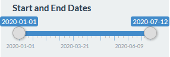
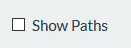
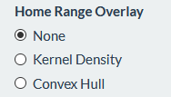
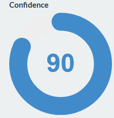

### Tracking Tigers in Panna National Park

This application allows you to identify Panna Tiger home ranges using various statistical methods at different points throughout the year.

#### User Guide

---  

#### Start and End Dates

Adjust the time slider to only display detections within the specified range. Paths and Home Range Overlays will update accordingly.

---  

#### Play Button

Narrow the time slider to a single week and then hit the **Play Button** to watch how detections change over time. Pair this with the **Show Paths** and **Estimation Overlay** options to see how a single tiger traverses their habitat.

---  

#### Show Paths

Toggle the **Show Paths** option to connect detections chronologically. Pair this with the **Play Button** to track individual tiger movements over time.

---  

#### Home Range Overlay

Overlay a home range / utilization distribution (UD) by specifying either a Kernel Density or Convex Hull estimation (i.e. Minimum Convex Polygon). These estimatations are produced using the `KernelUD()` and `mcp()` functions from the [adehabitatHR](https://cran.r-project.org/web/packages/adehabitatHR/index.html) package written by Clement Calenge with contributions from Scott Fortmann-Roe. 

Toggle the **Show Paths** option to observe paths and determine the best places to observe a specific tiger.

Pair with the **Time Slider** to see how the home range changes over time.

*Note: The Kernel Density model is susceptible to issues extending from auto-correlation and may benefit from employing a Brownian Bridge approach or an [autocorrelated kernel density estimation](https://cran.r-project.org/web/packages/ctmm/vignettes/akde.html). See [A Comprehensive Analysis of Autocorrelation and Bias in Home Range Estimation](https://www.researchgate.net/publication/329312244_A_comprehensive_analysis_of_autocorrelation_and_bias_in_home_range_estimation) for more information.*

---  

#### Confidence Dial

Turn the dial to adjust the estimation percent indicating the likelihood of the tiger being found in the area during the specified time frame.

---  

#### Citations

Calenge C (2006). "The package adehabitat for the R software: tool for the analysis of space and habitat use by animals." Ecological Modelling, 197, 1035.

https://www.zoatrack.org (2019) Data from: '2019.' ZoaTrack.org Date Accessed: 01 Sep 2020.